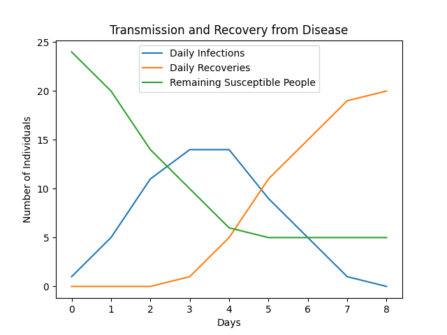

# outbreakProject  
Simulates the spread of a disease through a population and uses Matplotlib Pyplot to generate a plot of the simulation.  Infected individuals infect adjacent susceptible individuals and then recover over time.    

Example input file contents:  
Threshold:1  
Infectious Period:3  
s,s,s,s,s,s,s,s  
v,v,v,s,v,v,v,s  
s,s,s,i,s,s,s,s  
v,v,v,s,v,v,v,v  
s,s,v,s,v,s,s,s  

`s` represents a susceptible individual, `i` represents an infected individual, `r` represents a recovered individual, and `v` represents a vaccinated (immune) individual

Example output (from the 4th simulated day of the above population):  
`i i i i i i i s`  
`v v v r v v v i`  
`i i r r r i i i`  
`v v v r v v v v`  
`s s v i v s s s` 
